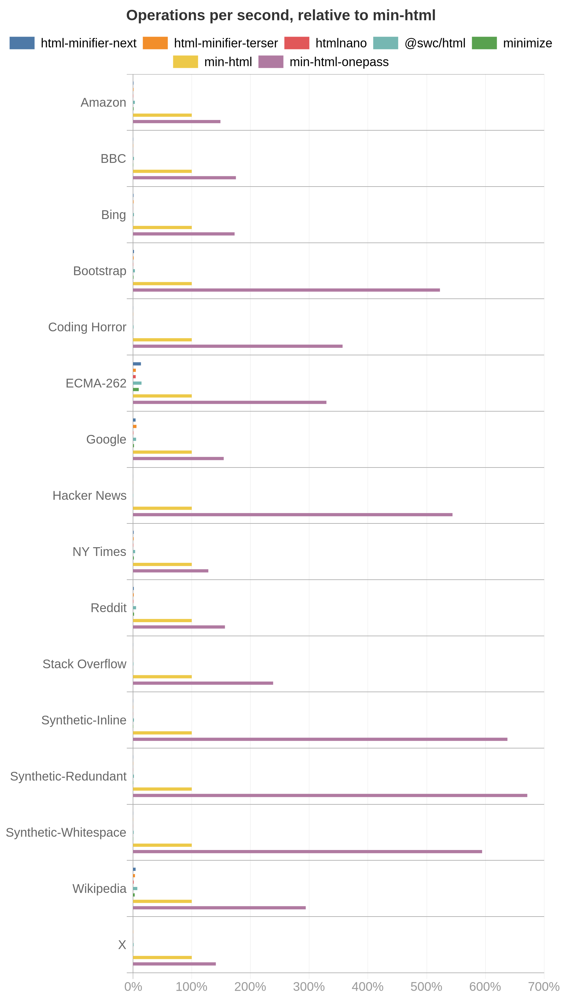
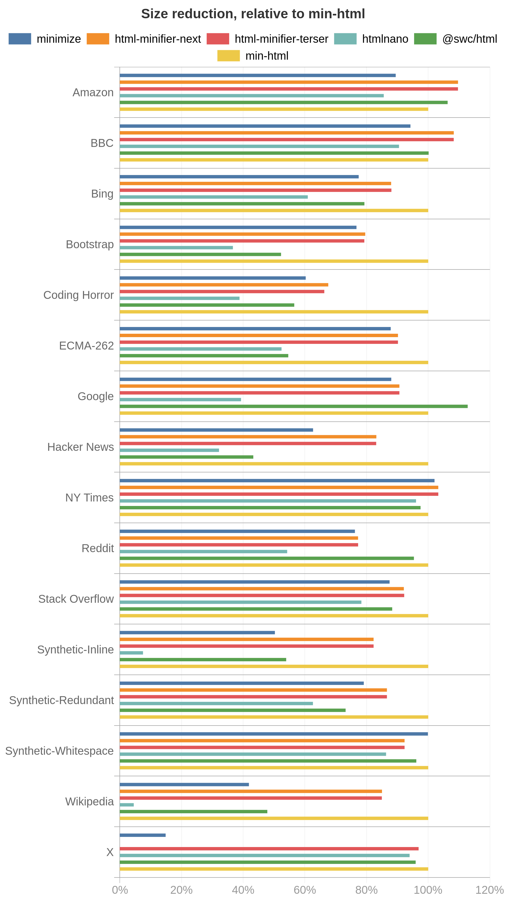

# Benchmarking

This folder contains scripts used to test the performance and effectiveness of min-html, for guided optimisation and/or comparisons.

It also contains a set of common web pages as inputs for benchmarking.

## Comparison

Each minifier is run against each file in the [inputs](./inputs) folder, which are HTML pages fetched from popular websites, plus synthetic unminified inputs:

|File name|URL|
|---|---|
|Amazon|https://www.amazon.com/|
|BBC|https://www.bbc.co.uk/|
|Bootstrap|https://getbootstrap.com/docs/3.4/css/|
|Bing|https://www.bing.com/|
|Coding Horror|https://blog.codinghorror.com/|
|ECMA-262|https://www.ecma-international.org/ecma-262/10.0/index.html|
|Google|https://www.google.com/|
|Hacker News|https://news.ycombinator.com/|
|NY Times|https://www.nytimes.com/|
|Reddit|https://www.reddit.com/|
|Stack Overflow|https://www.stackoverflow.com/|
|X|https://x.com/|
|Wikipedia|https://en.wikipedia.org/wiki/Soil|
|Synthetic-Whitespace|Generated: whitespace-heavy HTML|
|Synthetic-Redundant|Generated: redundant attributes and comments|
|Synthetic-Inline|Generated: inline CSS/JS heavy HTML|

The competitors are:

- [html-minifier-next](https://github.com/j9t/html-minifier-next)
- [html-minifier-terser](https://github.com/terser/html-minifier-terser)
- [htmlnano](https://github.com/posthtml/htmlnano)
- [@swc/html](https://github.com/swc-project/swc)
- [minimize](https://github.com/Swaagie/minimize)

**Note that the real-world pages are already mostly minified, while the synthetic inputs are intentionally unminified to stress-test whitespace and attribute reduction.**

For more information on how the inputs are fetched, see [fetch.js](./fetch.js).

On this [project's README](../README.md), average graphs are shown. Graphs showing per-input results are shown below:

Results depend on the input, so charts show performance relative to min-html as a percentage.

## Running

Run [build](./build) to build the minifiers.

Run [run](./run) to benchmark each HTML minifier against each input and output the results to the `results` folder. The default number of iterations is 5; set `MHB_ITERATIONS` to change it.

Run [graph.js](./graph.js) to render graphs to the `graphs` folder.
