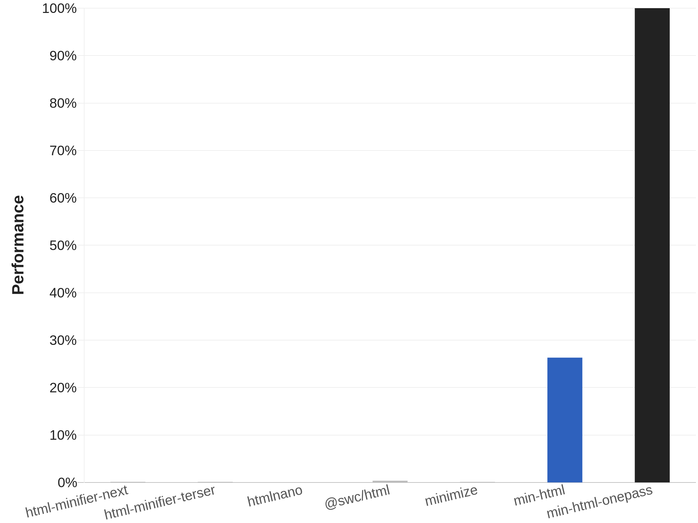

# min-html-onepass

An HTML minifier that provides the functionality of [min-html](https://github.com/QQSHI13/min-html) with much more performance, but with stricter parsing and less configurability.

- Uses the same advanced minification strategy.
- Minifies in one pass with zero memory allocations.
- Outputs in place; no copy or buffer required.

## Performance

## Usage

The API is different compared to min-html; refer to per-package documentation for more details.

-  [min-html-onepass](https://pypi.org/project/min-html-onepass)
-  [min-html-onepass](https://crates.io/crates/min-html-onepass)

If you don't see your preferred language here and the main library supports it, raise an issue.

## Parsing

In addition to the [min-html rules](https://github.com/QQSHI13/min-html/blob/master/notes/Parsing.md), the onepass variant has additional requirements:

- Opening tags must not be omitted.
- Invalid closing tags are not allowed.
- The document cannot end unexpectedly.
